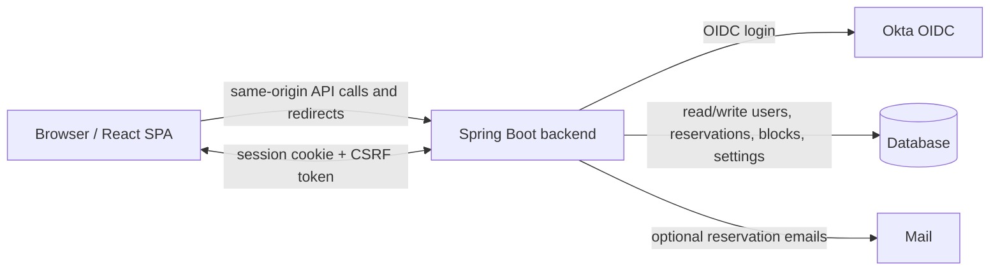

# GamePlan

GamePlan is a web app for managing athletic equipment, reservations, schedule blocks, and role-based access for students, athletes, athletic trainers, and admins. It uses a Spring Boot backend, a React + TypeScript frontend, Okta-based OIDC login, and a shared calendar-driven workflow for booking and blocking time.

The main idea is simple: users sign in with their Carroll identity, GamePlan links that identity to a local user record, and the stored application role decides what they can see and do.

## What GamePlan Does

- Lets athletes reserve available equipment within configured calendar windows.
- Lets athletic trainers and admins review, edit, and cancel reservations.
- Lets trainers and admins manage equipment, equipment types, and equipment status.
- Lets admins manage users, roles, pending approvals, and global app settings.
- Supports shared schedule blocks, including open windows and weekend auto-blocking.
- Sends in-app notifications and optional email notifications for reservation changes.

## How It Works



The frontend is packaged into the backend JAR for production. In development, Vite proxies `/api`, `/oauth2`, `/login`, and `/logout` to the Spring Boot server so the login flow, logout flow, and CSRF handling behave like the deployed app.

## Roles

- `Student` users can exist as pending requests until approved.
- `Athlete` users can reserve equipment and manage their own bookings.
- `Athletic Trainer` users can manage reservations, blocks, and equipment.
- `Admin` users can manage everything, including roles, settings, and equipment metadata.

Role checks happen in the backend. The local `users` table is the source of truth for role, approval state, and session invalidation.

## Main Features

### Authentication and Sessions

- Okta OIDC login.
- Local user provisioning and email-based linking for precreated users.
- Session invalidation when a user’s role changes.
- CSRF protection for unsafe requests from the SPA.

### Reservations

- Create reservations for available equipment.
- Prevent overlapping bookings.
- Enforce past-time, weekend, and block restrictions.
- Edit or cancel reservations when authorized.
- Notify users when trainers or admins cancel reservations.

### Schedule Blocks

- Create, update, and delete blocks.
- View blocks on the shared calendar.
- Add open windows for staffed time.
- Enable weekend auto-blocking from app settings.
- Cancel conflicting reservations when a blocking window is created.

### Equipment

- Create, update, and delete equipment.
- Manage equipment status such as available or maintenance.
- Define equipment types with dynamic attribute schemas.
- Preserve equipment-specific attributes across updates.

### Admin Tools

- View and manage all users.
- Approve or promote users between roles.
- See pending approval counts.
- Change global app settings that control calendar behavior.

### Notifications

- In-app unread notification lists and counters.
- Notifications for reservation cancellations and maintenance actions.

## Repository Layout

```text
GamePlan/
  backend/                  Spring Boot API, security, persistence, and server-side templates
  frontend/                 React + TypeScript SPA
  documentation/            Manuals, diagrams, and UI drafts
  README.md                 This project overview
```

### Backend Highlights

- `backend/src/main/java/edu/carroll/gameplan/config/` configuration, seed data, and security setup
- `backend/src/main/java/edu/carroll/gameplan/controller/` REST controllers and route forwarding
- `backend/src/main/java/edu/carroll/gameplan/service/` business logic for reservations, equipment, blocks, users, settings, and notifications
- `backend/src/main/java/edu/carroll/gameplan/model/` JPA entities and enums
- `backend/src/main/resources/application*.yaml` environment-specific configuration

### Frontend Highlights

- `frontend/src/App.tsx` app routes and authenticated shell
- `frontend/src/auth/` auth context and route guard
- `frontend/src/pages/` page-level screens
- `frontend/src/components/` reusable UI pieces
- `frontend/src/api/` backend API wrappers
- `frontend/src/util/` shared helpers for time, parsing, and app events

## Tech Stack

- Java 21
- Spring Boot 4
- Spring Security with OAuth2 / OIDC
- Spring Data JPA
- React 19
- TypeScript
- Vite 7
- Tailwind CSS 4
- Day.js
- Vitest and React Testing Library

## Local Development

### Prerequisites

- Java 21
- Node.js and npm
- Access to an Okta tenant or a local development authentication setup
- A database choice for the active Spring profile

### 1. Start the backend

From `backend/`:

```bash
./gradlew bootRun
```

The dev profile uses an in-memory H2 database and starts the app on port `8080`.

### 2. Start the frontend

From `frontend/`:

```bash
npm ci
npm run dev
```

The Vite dev server runs at:

```text
http://localhost:5173
```

### 3. Open the app

Visit the frontend URL above, sign in through Okta, and GamePlan will load your profile and route you to the correct landing page for your role.

## Production Build

The backend packages the frontend automatically.

From `backend/`:

```bash
./gradlew bootJar
```

That task runs the frontend build, copies `frontend/dist` into the Spring Boot JAR, and produces a single deployable artifact.

Production settings live in `backend/src/main/resources/application-prod.yaml`.

## Configuration Notes

- Development uses `http://localhost:5173` and allows both `http://localhost:5173` and `https://localhost:5173` in CORS.
- Production is configured for `gameplan.carroll.edu` and uses forwarded headers so Spring can build the right public callback URL.
- The app reads OAuth2/OIDC settings, allowed origins, and success/logout URLs from the active Spring profile.
- Email notifications are optional and controlled by environment variables.

## Scripts

### Backend

```bash
./gradlew bootRun
./gradlew test
./gradlew bootJar
```

### Frontend

```bash
npm run lint
npm test
npm run test:watch
npm run build
npm run preview
```

## Key Endpoints

This is not a full API reference, but these routes are the backbone of the app:

- `/api/user` current user profile and role
- `/api/reservations` user reservations
- `/api/reservations/admin` admin and trainer reservation view
- `/api/blocks` shared schedule blocks
- `/api/admin/users` user management
- `/api/admin/settings` global settings
- `/api/equipment` equipment management
- `/api/equipment-types` equipment type management
- `/api/notifications` unread notifications
- `/api/health` health check

## Data and Rules Worth Knowing

- The backend stores users in a local `users` table and resolves the current user by OIDC subject.
- `authVersion` is used to invalidate stale sessions after a role or approval change.
- Reservation start/end times are validated in the application zone `America/Denver`.
- Weekend blocking can be enabled from app settings and is synchronized into schedule blocks.
- Equipment status changes to maintenance can cancel active reservations and notify affected users.
- CSRF tokens are fetched through `/api/csrf` and mirrored by the SPA on unsafe requests.

## User Guides

If you want the operational manuals instead of the project overview, see:

- [Athlete manual](documentation/manuals/AthleteManual.md)
- [Athletic trainer manual](documentation/manuals/AthleticTrainerManual.md)
- [Admin manual](documentation/manuals/UpdatedAdminManual.md)
- [Backend developer guide](documentation/manuals/BackendDeveloperGuide.md)
- [Frontend developer guide](documentation/manuals/FrontendDeveloperGuide.md)

## Common Workflows

### Athlete Flow

1. Sign in with Okta.
2. Open the reservation page.
3. Pick equipment, date, and time.
4. Submit the reservation.
5. Monitor notifications for updates or cancellations.

### Trainer Flow

1. Sign in with Okta.
2. Review active reservations on the home dashboard.
3. Update equipment as needed.
4. Cancel or adjust reservations when the schedule changes.

### Admin Flow

1. Sign in with Okta.
2. Review pending users and role changes.
3. Update app settings, equipment, and equipment types.
4. Manage users and resolve access issues when needed.

## Notes for Maintainers

- Keep backend and frontend route changes in sync.
- Update the manuals in `documentation/manuals/` when a user-facing workflow changes.
- Treat auth, role changes, and session invalidation as tightly coupled areas.
- If you change the frontend build or dev proxy, verify the same-origin OAuth2 flow still works end to end.
