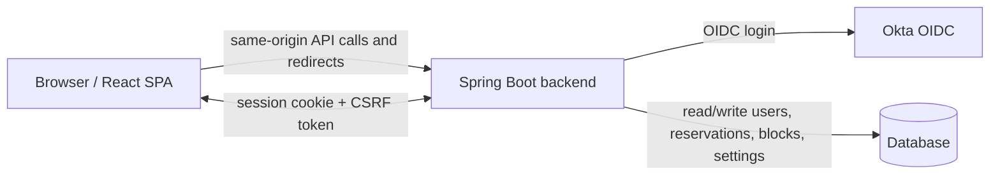

# GamePlan

GamePlan is a web app for managing athletic equipment, reservations, schedule blocks, and role-based access for students, athletes, athletic trainers, and admins. It uses a Spring Boot backend, a React + TypeScript frontend, Okta-based OIDC login, and a shared calendar-driven workflow for booking and blocking time.

The main idea is simple: users sign in with their Carroll identity, GamePlan links that identity to a local user record, and the stored application role decides what they can see and do.

## What GamePlan Does

- Lets athletes reserve available equipment within configured calendar windows.
- Lets athletic trainers and admins review, edit, and cancel reservations.
- Lets trainers and admins manage equipment, equipment types, and equipment status.
- Lets admins manage users, roles, pending approvals, and global app settings.
- Supports shared schedule blocks, including open windows and weekend auto-blocking.
- Sends in-app notifications for reservation changes and maintenance actions.

## How It Works



The frontend is packaged into the backend JAR for production. In development, Vite proxies `/api`, `/oauth2`, `/login`, and `/logout` to the Spring Boot server so the login flow, logout flow, and CSRF handling behave like the deployed app.

## Roles

- `Student` users can exist as pending requests until approved.
- `Athlete` users can reserve equipment and manage their own bookings.
- `Athletic Trainer` users can manage reservations, blocks, and equipment.
- `Admin` users can manage everything, including roles, settings, and equipment metadata.

Role checks happen in the backend. The local `users` table is the source of truth for role, approval state, and session invalidation.

| Capability | Student | Athlete | Athletic Trainer | Admin |
| --- | --- | --- | --- | --- |
| Sign in and view profile | Yes | Yes | Yes | Yes |
| Create reservations | No | Yes | Yes | Yes |
| Edit or cancel own reservations | No | Yes | Yes | Yes |
| View schedule blocks | No | Yes | Yes | Yes |
| Manage schedule blocks | No | No | Yes | Yes |
| View and manage all athlete reservations | No | No | Yes | Yes |
| Manage equipment and equipment types | No | No | Yes | Yes |
| Manage users, roles, pending approvals, and app settings | No | No | No | Yes |

## Main Features

### Authentication and Sessions

- Okta OIDC login.
- Local user provisioning and email-based linking for precreated users.
- Session invalidation when a user’s role changes.
- CSRF protection for unsafe requests from the SPA.

### Reservations

- Create reservations for available equipment.
- Prevent overlapping bookings.
- Enforce past-time, weekend, and block restrictions.
- Edit or cancel reservations when authorized.
- Notify users when trainers or admins cancel reservations.

### Schedule Blocks

- Create, update, and delete blocks.
- View blocks on the shared calendar.
- Add open windows for staffed time.
- Enable weekend auto-blocking from app settings.
- Cancel conflicting reservations when a blocking window is created.

### Equipment

- Create, update, and delete equipment.
- Manage equipment status such as available or maintenance.
- Define equipment types with dynamic attribute schemas.
- Preserve equipment-specific attributes across updates.

### Admin Tools

- View and manage all users.
- Approve or promote users between roles.
- See pending approval counts.
- Change global app settings that control calendar behavior.

### Notifications

- In-app unread notification lists and counters.
- Notifications for reservation cancellations and maintenance actions.

## Repository Layout

```text
GamePlan/
  backend/                  Spring Boot API, security, persistence, and server-side templates
  frontend/                 React + TypeScript SPA
  documentation/            Manuals, diagrams, and UI drafts
  README.md                 This project overview
```

### Backend Highlights

- `backend/src/main/java/edu/carroll/gameplan/config/` configuration, seed data, and security setup
- `backend/src/main/java/edu/carroll/gameplan/controller/` REST controllers and route forwarding
- `backend/src/main/java/edu/carroll/gameplan/service/` business logic for reservations, equipment, blocks, users, settings, and notifications
- `backend/src/main/java/edu/carroll/gameplan/model/` JPA entities and enums
- `backend/src/main/resources/application*.yaml` environment-specific configuration

### Frontend Highlights

- `frontend/src/App.tsx` app routes and authenticated shell
- `frontend/src/auth/` auth context and route guard
- `frontend/src/pages/` page-level screens
- `frontend/src/components/` reusable UI pieces
- `frontend/src/api/` backend API wrappers
- `frontend/src/util/` shared helpers for time, parsing, and app events

## Tech Stack

- Java 21
- Spring Boot 4
- Spring Security with OAuth2 / OIDC
- Spring Data JPA
- React 19
- TypeScript
- Vite 7
- Tailwind CSS 4
- Day.js
- Vitest and React Testing Library

## Local Development

### Prerequisites

- Java 21
- Node.js and npm
- MySQL running locally for the explicit dev profile
- Access to an Okta tenant or a local development authentication setup
- A database choice for any custom Spring profile

### 1. Create the local dev database

The default Spring profile is `prod`. For local development, run the backend with the explicit `dev` profile. The dev profile uses the MySQL connection in `backend/src/main/resources/application-dev.yaml` and recreates the schema on startup.

```sql
CREATE DATABASE gameplan_db;
CREATE USER 'gameplan_user'@'localhost' IDENTIFIED BY 'GamePlan123!';
GRANT ALL PRIVILEGES ON gameplan_db.* TO 'gameplan_user'@'localhost';
FLUSH PRIVILEGES;
```

### 2. Start the backend

From `backend/`:

```bash
./gradlew bootRun --args='--spring.profiles.active=dev'
```

The explicit dev profile starts the app on port `8080`, recreates the local schema with `ddl-auto: create`, and seeds baseline plus dev-only sample data.

### 3. Start the frontend

From `frontend/`:

```bash
npm ci
npm run dev
```

The Vite dev server runs at:

```text
http://localhost:5173
```

### 4. Open the app

Visit the frontend URL above, sign in through Okta, and GamePlan will load your profile and route you to the correct landing page for your role.

## Production Build

The backend packages the frontend automatically.

From `backend/`:

```bash
./gradlew bootJar
```

That task runs the frontend build, copies `frontend/dist` into the Spring Boot JAR, and produces a single deployable artifact.

Production settings live in `/etc/gameplan/` on the deployed VM. Local profile YAML files under `backend/src/main/resources` are intentionally ignored so environment-specific values and secrets do not get committed.

## Configuration Notes

- The expected YAML shapes for every Spring profile are documented in [BackendDeveloperGuide.md](documentation/manuals/BackendDeveloperGuide.md).
- `backend/src/main/resources/application-example.yaml` is a tracked placeholder template for local and production-style settings.
- There is no main-resource `application.yaml`; `prod` is the application fallback profile.
- `backend/src/main/resources/application-dev.yaml` is selected explicitly for local development and uses `spring.jpa.hibernate.ddl-auto: create`.
- `backend/src/main/resources/application-prod.yaml` is production-style config for local packaging checks only; deployed production values belong in `/etc/gameplan/`.
- `backend/src/test/resources/application.yaml` uses an in-memory H2 database with `create-drop` for tests.
- Deployed production settings should be supplied from `/etc/gameplan/` so VM-specific values and secrets are not tied to the Git checkout.
- Logging levels, patterns, and appenders are configured in `backend/src/main/resources/logback-spring.xml`.
- Notifications are stored in the database and shown in the app. There is no email notification subsystem.

## Scripts

### Backend

```bash
./gradlew bootRun --args='--spring.profiles.active=dev'
./gradlew test
./gradlew bootJar
```

### Frontend

```bash
npm run lint
npm test
npm run test:watch
npm run build
npm run preview
```

## Key Endpoints

This is a lightweight route map for the main API surface:

| Route | Methods | Access | Purpose |
| --- | --- | --- | --- |
| `/api/csrf` | `GET` | Public | Creates/exposes the CSRF token cookie for the SPA. |
| `/api/health` | `GET` | Authenticated | Basic application health check. |
| `/api/user` | `GET` | Authenticated | Current user profile, role, and pending status. |
| `/api/reservations` | `GET`, `POST` | Authenticated users; UI exposes creation to approved roles | Current user's reservations and reservation creation. |
| `/api/reservations/{id}` | `PUT`, `DELETE` | Owner, trainer, or admin | Edit or cancel a reservation. |
| `/api/reservations/{equipmentId}` | `GET` | Authenticated | Future active reservations for one equipment item. |
| `/api/reservations/admin` | `GET` | Trainer or admin | All active athlete reservations for staff review. |
| `/api/blocks` | `GET` | Authenticated | Active schedule blocks for the calendar. |
| `/api/blocks` | `POST` | Trainer or admin | Create a block or open window. |
| `/api/blocks/{id}` | `PUT`, `DELETE` | Trainer or admin | Update or cancel a schedule block. |
| `/api/admin/users` | `GET`, `POST` | Admin | List users or create a pending student. |
| `/api/admin/users/{userId}/role` | `POST` | Admin | Change a user's role and invalidate stale sessions. |
| `/api/admin/users/pending-count` | `GET` | Admin | Count pending student accounts. |
| `/api/admin/settings` | `GET` | Authenticated | Current calendar and reservation settings. |
| `/api/admin/settings` | `PUT` | Admin | Update global app settings. |
| `/api/equipment` | `GET`, `POST` | Trainer or admin | List or create equipment. |
| `/api/equipment/{id}` | `GET`, `PUT`, `DELETE` | Trainer or admin | View, update, or delete equipment. |
| `/api/equipment/{id}/status` | `PUT` | Trainer or admin | Change equipment status, including maintenance. |
| `/api/equipment-types` | `GET` | Authenticated | List equipment categories. |
| `/api/equipment-types` | `POST` | Trainer or admin | Create equipment categories. |
| `/api/equipment-types/{id}` | `PUT`, `DELETE` | Trainer or admin | Update or delete equipment categories. |
| `/api/equipment-types/{id}/attributes*` | `GET` | Authenticated | Read dynamic attribute metadata. |
| `/api/equipment-types/{typeId}/equipment` | `GET` | Authenticated | Find available equipment and reservations by type/attribute. |
| `/api/notifications` | `GET` | Authenticated | Current user's unread in-app notifications. |
| `/api/notifications/unread-count` | `GET` | Authenticated | Current user's unread notification count. |
| `/api/notifications/{id}/read` | `PATCH` | Notification owner | Mark one notification as read. |

## Data and Rules Worth Knowing

- The backend stores users in a local `users` table and resolves the current user by OIDC subject.
- `authVersion` is used to invalidate stale sessions after a role or approval change.
- Reservation start/end times are validated in the application zone `America/Denver`.
- Reservation windows must have an end time after the start time, cannot start in the past, cannot overlap another active reservation for the same equipment, and cannot overlap another active reservation owned by the same user.
- The app settings `startTime`, `endTime`, `timeStep`, and `maxReservationTime` drive the frontend's reservation and edit time choices.
- Trainers and admins can edit or cancel athlete reservations; athletes can edit or cancel their own future reservations.
- Weekend blocking can be enabled from app settings and is synchronized into schedule blocks.
- Blocking schedule blocks cancel conflicting reservations. Open-window blocks mark staffed availability but do not cancel reservations.
- Equipment status changes to maintenance can cancel active reservations and notify affected users.
- Notifications are in-app only.
- CSRF tokens are fetched through `/api/csrf` and mirrored by the SPA on unsafe requests.

## User Guides

If you want the operational manuals instead of the project overview, see:

- [Athlete manual](documentation/manuals/AthleteManual.docx)
- [Athletic trainer manual](documentation/manuals/AthleticTrainerManual.docx)
- [Admin manual](documentation/manuals/AdminManual.docx)
- [Backend developer guide](documentation/manuals/BackendDeveloperGuide.md)
- [Frontend developer guide](documentation/manuals/FrontendDeveloperGuide.md)

## Troubleshooting

### Okta login fails or redirects to the wrong place

- Confirm the Okta app has the same sign-in redirect URI as the active Spring profile.
- For local dev, the expected callback is usually `http://localhost:8080/login/oauth2/code/okta`.
- For production, the expected callback is usually `http://gameplan.carroll.edu/authorization-code/callback`.
- Confirm `issuer-uri`, `client-id`, `client-secret`, `app.security.success-url`, `app.security.logout-url`, and `app.security.allowed-origins` all match the same environment.

### A user signs in but does not have the expected access

- Check the local `users` table role and pending approval state.
- Make sure Okta sends the same email address as any precreated or seeded local user.
- Have the user sign out and sign back in after role changes so stale sessions pick up the new `authVersion`.

### Reservation times look wrong or blocked

- Check app settings for start/end time, time step, max reservation time, days shown, and weekend auto-blocking.
- Check active schedule blocks for the requested date.
- Check equipment status and overlapping active reservations.

## Common Workflows

### Athlete Flow

1. Sign in with Okta.
2. Open the reservation page.
3. Pick equipment, date, and time.
4. Submit the reservation.
5. Monitor notifications for updates or cancellations.

### Trainer Flow

1. Sign in with Okta.
2. Review active reservations on the home dashboard.
3. Update equipment as needed.
4. Cancel or adjust reservations when the schedule changes.

### Admin Flow

1. Sign in with Okta.
2. Review pending users and role changes.
3. Update app settings, equipment, and equipment types.
4. Manage users and resolve access issues when needed.

## Notes for Maintainers

- Keep backend and frontend route changes in sync.
- Update the manuals in `documentation/manuals/` when a user-facing workflow changes.
- Treat auth, role changes, and session invalidation as tightly coupled areas.
- If you change the frontend build or dev proxy, verify the same-origin OAuth2 flow still works end to end.
